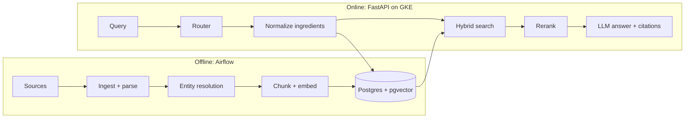

# SkinSync 2.0 — Skincare Ingredient RAG: Technical Spec

Sep 26, 2026 · @Siya

## Overview

SkinSync 2.0 is a deployed retrieval-augmented generation (RAG) service that answers skincare ingredient questions with cited evidence. It resolves messy ingredient names to canonical entities, combines structured product data with research text, and ships on Kubernetes with a published evaluation.

**Problem.** Ingredient lists are hard to read, the same ingredient goes by many names, and advice online is mostly marketing. People want quick, grounded answers: does this conflict with my routine, and is this product right for my skin?

**Goals**

- Answer ingredient-interaction, ingredient-info, and product-suitability questions with a citation on every claim.
- Resolve ingredient aliases (INCI, common, and chemical names) to one canonical entity with measured accuracy.
- Run as a public, containerized API on GKE, provisioned with Terraform and refreshed by Airflow.
- Publish a reproducible evaluation: retrieval, faithfulness, citation, and entity-resolution metrics.

**Non-goals**

- Diagnosing skin conditions or giving medical advice.
- Recommending prescription treatments or dosages.
- Covering every product on the market; the MVP targets a few thousand products.

**Why it matters for recruiting.** It extends a project already on the resume, and it hits the signals ML, SWE, and FDE reviewers screen for: RAG, entity resolution over messy data, evaluation, and production deployment. It also closes the GCP, Kubernetes, Terraform, and FastAPI gaps.

## User stories and example queries

The MVP supports four query types, and each maps to a different retrieval path (see Retrieval and generation).

| Query type | Example | What a good answer does |
| --- | --- | --- |
| Ingredient interaction | "Is niacinamide safe to use with my retinol?" | Resolves both ingredients, cites studies on the pair, and states the evidence strength |
| Ingredient info | "What does sodium hyaluronate do?" | Maps the alias to hyaluronic acid, gives its function and typical use, and cites sources |
| Product suitability | "Which of these three moisturizers suits acne-prone skin?" | Pulls each product's ingredient list, flags known comedogenic or irritant ingredients, and compares |
| Routine check | "Here's my AM and PM routine. Any conflicts?" | Checks every ingredient pair across products and lists flagged pairs with citations |

Every answer carries citations, and every answer says so when evidence is weak or missing.

## Tech stack

The stack is deliberately small: one language (Python), one database (Postgres with pgvector), and one cloud (GCP). Each choice should be easy to defend in an interview.

| Layer | Choice | Why |
| --- | --- | --- |
| Language | Python 3.12 | Matches the ML ecosystem and Capital One work |
| API | FastAPI + Pydantic | Typed request/response schemas, async, and auto-generated OpenAPI docs; closes the FastAPI gap |
| Database | PostgreSQL 16 + pgvector | One store for relational data (products, ingredients, aliases) and vectors; keeps joins and hybrid search in SQL |
| Keyword search | Postgres full-text search (tsvector) | BM25-style matching for exact ingredient names, with no extra service |
| Embeddings | Open-source model (e.g., bge-small) or a hosted embeddings API | Start hosted for speed, then benchmark an open-source model as an eval experiment |
| Reranker | Cross-encoder reranker (e.g., bge-reranker) | Lifts precision on the top results; its effect is measured in the eval |
| LLM | Hosted LLM API with structured output | Generates cited answers and powers extraction and entity adjudication |
| Fuzzy matching | RapidFuzz | Fast string similarity for alias candidates |
| Orchestration | Apache Airflow | Scheduled ingestion and re-indexing; mirrors the new team's work |
| Eval | pytest + a custom harness (optionally RAGAS) | Metrics run in CI on every change |
| Tracing | OpenTelemetry + Langfuse (or similar) | Per-request traces of retrieval, reranking, and generation, plus cost and latency |
| Containers | Docker | One image each for the API, workers, and Airflow |
| Platform | GKE Autopilot + Cloud SQL | Managed Kubernetes and Postgres; closes the GCP and Kubernetes gaps |
| IaC | Terraform | Cluster, database, secrets, and networking as code |
| CI/CD | GitHub Actions | Lint, test, eval gate, build, and deploy |
| Frontend | Streamlit (MVP) | A fast demo UI; the backend is the showcase |
| Image model | CreateML model ported to PyTorch (or ONNX) | Runs server-side for the multimodal feature |

## System architecture

The system has two halves: an offline pipeline that builds the knowledge base, and an online API that answers questions against it.

**Request flow**

1. The router classifies the question as interaction, info, suitability, or routine check.
2. Ingredient mentions are extracted and resolved to canonical IDs using the same resolver the pipeline uses.
3. Structured facts come from SQL (product ingredient lists, known flags). Evidence text comes from hybrid search.
4. A reranker trims the candidates to the top 5–8 chunks.
5. The LLM writes an answer using only the provided context and must cite a chunk ID for each claim.
6. A validator checks that every citation exists and supports its claim, then returns JSON to the client.

## Data sources and ingestion

The MVP uses only public data. Before ingesting any source, check its license and terms of use, and record them in the repo.

| Source | What it provides | Used for |
| --- | --- | --- |
| EU CosIng database | INCI names, ingredient functions, regulatory restrictions | Canonical ingredient list and function tags |
| PubChem | Chemical synonyms and identifiers | Alias expansion for entity resolution |
| Open Beauty Facts | Crowd-sourced product ingredient lists | Product catalog for suitability questions |
| PubMed / PMC open-access subset | Abstracts and full-text dermatology papers | Evidence chunks for interactions and effects |
| FDA OTC monographs (acne, sunscreen) | Approved active ingredients and concentrations | Authoritative facts on OTC actives |

**Airflow DAGs**

- `ingest_ingredients` (monthly): pulls CosIng and PubChem, then rebuilds the canonical and alias tables.
- `ingest_products` (weekly): pulls product records, parses ingredient strings, and resolves each ingredient.
- `ingest_papers` (weekly): queries PubMed for ingredient terms, fetches open-access text, then chunks and embeds it. The DAG is incremental, so already-indexed papers are skipped.
- `extract_interactions` (weekly): an LLM extracts candidate ingredient-pair findings from new papers into a review queue. Only reviewed rows go live.
- `run_eval` (nightly): runs the evaluation suite against the current index and stores the metrics.

Every DAG is idempotent, and each task writes a row to an `ingestion_runs` table with counts and errors.

## Data model

All data lives in one Postgres database. Structured facts and vector chunks share ingredient IDs, so a single query can join them.

| Table | Key columns | Notes |
| --- | --- | --- |
| `ingredients` | id, cosing\_id, inci\_name, functions\[\], restrictions, cas\_number | One row per canonical ingredient; `cosing_id` (CosIng substance ID) is the upsert key |
| `ingredient_aliases` | alias, ingredient\_id, source, confidence | Every known name, mapped to its canonical ingredient |
| `products` | id, source, source\_id, name, brand, category, raw\_ingredient\_text | Raw text is kept for debugging parses; (source, source\_id) is the upsert key, e.g. the Open Beauty Facts barcode |
| `product_ingredients` | product\_id, ingredient\_id, position, match\_confidence | Position approximates concentration order |
| `documents` | id, source, source\_id, pmid, title, url, published\_at, license, abstract, full\_text | One row per paper or monograph; (source, source\_id) is the upsert key, e.g. the PMCID. `abstract` and `full_text` are nullable, and `full_text` is filled only for CC BY or CC0 articles |
| `chunks` | id, document\_id, text, embedding vector(384), tsv, ingredient\_ids\[\] | Vector plus full-text index; ingredient tags enable filtered search |
| `interactions` | ingredient\_a, ingredient\_b, effect, evidence\_level, chunk\_ids\[\], reviewed | Only reviewed rows are used at query time |
| `ingestion_runs` / `eval_runs` | dag, started\_at, counts, metrics JSON | Operational history |

**Indexes.** An HNSW index on `chunks.embedding`, a GIN index on `chunks.tsv`, a GIN index on `chunks.ingredient_ids`, and a trigram index on `ingredient_aliases.alias`. Set the vector dimension to match whichever embedding model is chosen.

## Entity resolution

Entity resolution is the project's technical centerpiece. It maps any ingredient mention ("vitamin B3," "Niacinamide," "nicotinamide") to one canonical ingredient. It's also the part FDE and ML interviewers will ask about most.

**Cascade (cheapest first, stop at the first confident match)**

1. **Normalize:** lowercase, strip concentrations ("2%"), punctuation, and parenthetical notes; split compound strings like "Water/Aqua/Eau."
2. **Exact alias lookup** in `ingredient_aliases`.
3. **Fuzzy match:** RapidFuzz token-set ratio plus a Postgres trigram search; accept at a score of at least 92.
4. **Embedding match:** nearest canonical names by vector similarity; take the top 5 as candidates.
5. **LLM adjudication:** for scores below the threshold, the LLM picks one candidate or "none" in structured output. Its decision is cached as a new alias with its confidence.
6. **Unresolved:** log the mention to a review queue. Never guess.

**Measuring it.** Hold out about 300 labeled mention-to-ingredient pairs, including hard cases (misspellings, trade names, multilingual labels). Report precision, recall, and how many mentions each stage resolves. Compare cascade ablations, such as with and without the LLM step, so there's a tradeoff story to tell.

## Retrieval and generation

Each query type follows its own path, so retrieval stays precise rather than falling back on a generic top-k search.

| Query type | Structured step (SQL) | Unstructured step (search) |
| --- | --- | --- |
| Interaction | Look up reviewed rows in `interactions` for the pair | Hybrid search filtered to chunks tagged with both ingredients |
| Info | Fetch ingredient functions and restrictions | Hybrid search filtered to that ingredient |
| Suitability | Fetch each product's ingredient list and flags | Search evidence for the flagged ingredients only |
| Routine check | Expand every ingredient pair across products and check `interactions` | Search evidence for the flagged pairs only |

**Hybrid search.** Run vector search (top 30) and full-text search (top 30), merge them with reciprocal rank fusion, then rerank to the top 5–8. Ingredient-ID filters apply before ranking.

**Generation**

- The system prompt says to answer only from the provided context, cite a chunk ID for every claim, and say "insufficient evidence" instead of guessing.
- Output is JSON: `answer`, `claims[]` (each with text and chunk\_ids), `evidence_level`, and `disclaimer`.
- A post-check drops any claim whose cited chunk doesn't exist. An optional LLM check verifies that each chunk supports its claim.

**Endpoints.** `POST /ask`, `POST /analyze-routine`, `POST /analyze-image`, `GET /ingredients/{id}`, `GET /health` (liveness), and `GET /ready` (readiness).

## Multimodal feature (stretch)

The stretch goal is to let users photograph an ingredient label and get the same analysis as typing it. This is safer and more useful than photographing skin, and it reuses the whole pipeline.

- **Label photo → text:** OCR (for example, Google Cloud Vision or Tesseract), then feed the text through the same ingredient parser and resolver. Report parse accuracy on about 50 hand-labeled label photos.
- **Skin image model:** the original CreateML acne classifier only runs on Apple devices. To serve it from the API, retrain an equivalent PyTorch model (for example, a fine-tuned ResNet or EfficientNet) and export it to ONNX. Any output must be framed as "possible concern, consult a dermatologist," never as a diagnosis.
- Build the label-photo feature first. Add the skin model only if time allows, since it carries more safety risk.

## Evaluation

The published evaluation is what separates this from a tutorial project. Build the test sets before tuning anything, and report every change as a before/after.

**Test sets**

- About 100 questions across the four query types, each with gold supporting chunks and a reference answer, written by hand from the sources.
- About 20 unanswerable questions (no evidence exists), to test refusal.
- About 300 labeled ingredient mentions for entity resolution.

| Metric | What it measures | MVP target |
| --- | --- | --- |
| Recall@8 | Gold chunk appears in the reranked top 8 | ≥ 0.85 |
| MRR | Rank of the first gold chunk | Report only |
| Faithfulness | Share of claims supported by their cited chunks (LLM judge, spot-checked by hand) | ≥ 0.90 |
| Citation validity | Share of citations that exist and are relevant | ≥ 0.95 |
| Refusal accuracy | Unanswerable questions correctly declined | ≥ 0.90 |
| Entity resolution F1 | Mention-to-ingredient accuracy | ≥ 0.95 |
| p95 latency | End-to-end `/ask` time | < 4 s |
| Cost per query | LLM, embedding, and rerank spend | Report only |

**Experiments to report:** vector-only vs. hybrid search, with vs. without the reranker, two embedding models, and the entity-resolution cascade ablations. CI fails the build if faithfulness or Recall@8 drops more than 3 points from the last baseline.

## Deployment and infrastructure

Everything runs on GCP and is defined in Terraform, so the whole environment can be rebuilt from the repo with one command.

- **Terraform** provisions a GKE Autopilot cluster, a Cloud SQL Postgres instance (with the pgvector extension), Artifact Registry, Secret Manager for API keys, and Workload Identity so pods can access secrets without key files.
- **Kubernetes** runs the API as a Deployment with a HorizontalPodAutoscaler (for example, 1–4 replicas on CPU), a liveness probe on `/health` (process is up; no dependency checks, so a database outage doesn't restart pods) and a readiness probe on `/ready` (pings the database; added once the app uses it), and an Ingress with a managed TLS certificate. The reranker can run in the API pod at first and move to its own Deployment if latency requires it.
- **Airflow** runs on the same cluster using the official Helm chart with the KubernetesExecutor. Alternatively, use Cloud Composer if cluster management gets in the way.
- **CI/CD (GitHub Actions):** lint (ruff), type-check (mypy), unit tests, eval gate on a small fixed index, Docker build, push to Artifact Registry, then deploy with `kubectl` or Helm. `terraform plan` runs on PRs that touch infrastructure.
- **Observability:** structured JSON logs, OpenTelemetry traces for each pipeline stage, and a dashboard showing latency, error rate, cost per query, and nightly eval scores.
- **Cost control:** Autopilot scales pods down when idle, the smallest Cloud SQL tier is enough, and there's a per-IP rate limit on `/ask`. Set a GCP budget alert before launch, since free credits run out.

## Safety, legal, and responsible AI

This is a health-adjacent product, so its guardrails are part of the design, and interviewers will notice them.

- **Scope guard:** the router detects medical questions (prescriptions, infections, severe reactions, pregnancy) and returns a fixed "see a dermatologist or pharmacist" response with no generated advice.
- **Evidence levels:** every answer is labeled strong (clinical trials), moderate (smaller studies), or weak (in vitro or anecdotal).
- **Disclaimer:** every response and the UI state that the tool is informational, not medical advice.
- **Licensing:** store only data the source license allows. Show open-access text only, and link out to everything else.
- **Privacy:** don't store uploaded images or routines by default. Log queries without IP addresses.
- **Independence:** this is a personal project built entirely on public data, with no connection to any employer's code or data.

## Milestones

The plan assumes about 8–10 hours a week alongside work and grad school, for roughly 8 weeks to a resume-ready v1. Every phase ends with something demoable.

| Week | Milestone | Done when |
| --- | --- | --- |
| 1 | Data spike | CosIng, product, and PubMed samples load locally; licenses recorded |
| 2 | Entity resolution v1 | Cascade runs; labeled set built; first F1 reported |
| 3 | Retrieval v1 | Chunks embedded in local Postgres; hybrid search and rerank return results |
| 4 | Answers + eval harness | `/ask` returns cited JSON; 100-question eval runs locally |
| 5 | Airflow pipelines | Ingestion DAGs run on a schedule; incremental paper updates work |
| 6 | Cloud deploy | Terraform stands up GKE and Cloud SQL; API live over HTTPS; CI/CD green |
| 7 | Experiments + UI | Ablations reported; Streamlit demo; routine-check endpoint |
| 8 | Polish | README with architecture diagram and results table; demo video; resume bullet |
| Stretch | Label-photo OCR, then skin model | Parse accuracy reported |

If time gets tight, cut Airflow to one DAG and use Cloud Run instead of GKE, but keep the eval and entity resolution. They're the differentiators.

## Resume bullets and demo plan

These are templates. Fill the brackets with real measured results, and only once they exist.

**SkinSync 2.0 | Python, FastAPI, PostgreSQL/pgvector, Airflow, Kubernetes (GKE), Terraform**

- Built and deployed a RAG service answering skincare ingredient questions with cited evidence from \[N\] research papers and \[N\] products, serving answers at \[X\] s p95 latency on GKE provisioned with Terraform
- Designed a four-stage entity-resolution cascade (exact, fuzzy, embedding, LLM adjudication) mapping \[N\] ingredient aliases to canonical entities at \[X\] F1
- Built an evaluation harness gating CI on retrieval and faithfulness; hybrid search with reranking raised Recall@8 from \[X\] to \[Y\] and faithfulness to \[Z\]

**Demo checklist**

- [ ] Public HTTPS endpoint and Streamlit UI linked from the README
- [ ] README: problem, architecture diagram, results table, design decisions and tradeoffs
- [ ] 2-minute demo video: an interaction question, a routine check, and the eval dashboard
- [ ] Short write-up or blog post on entity-resolution lessons, to share on LinkedIn
